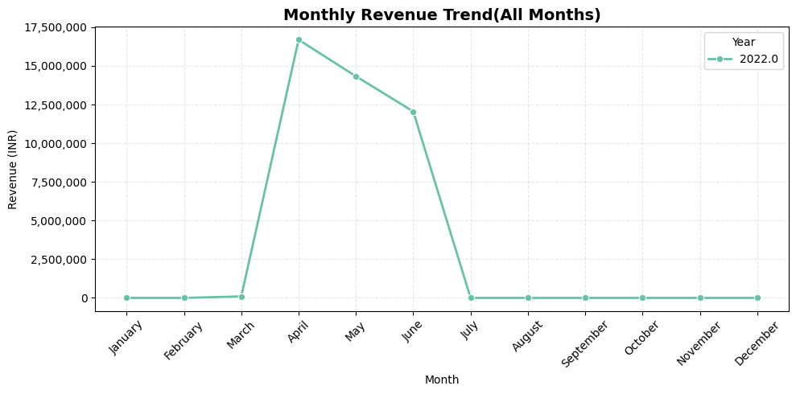
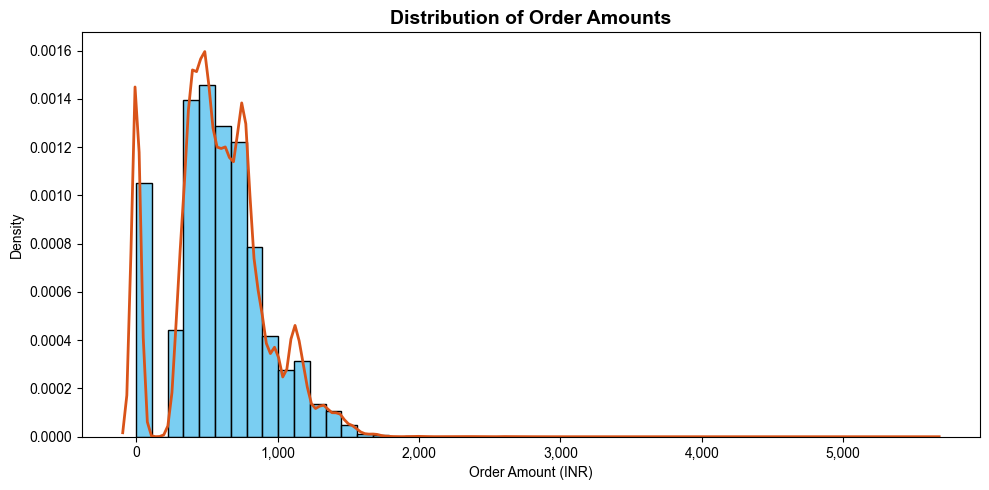
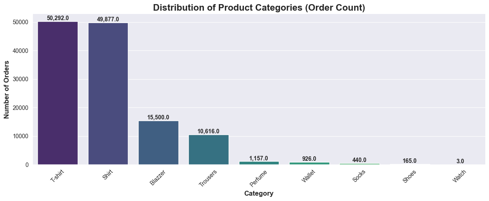
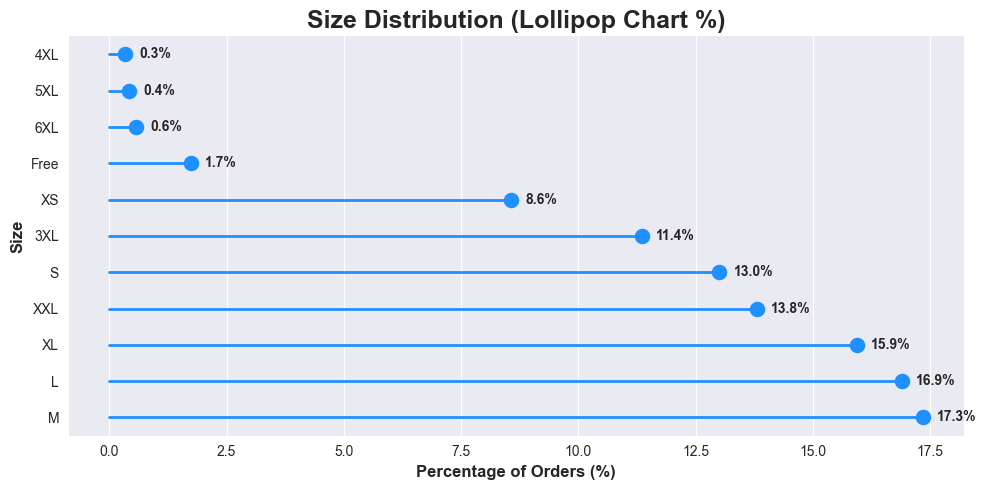
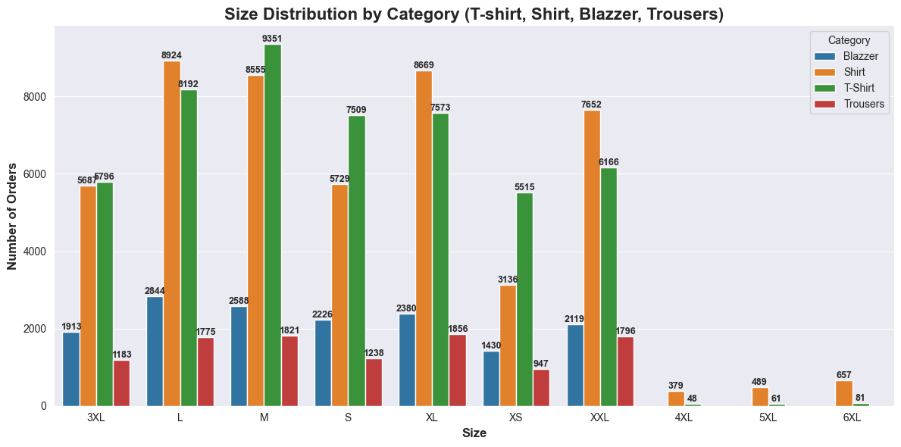
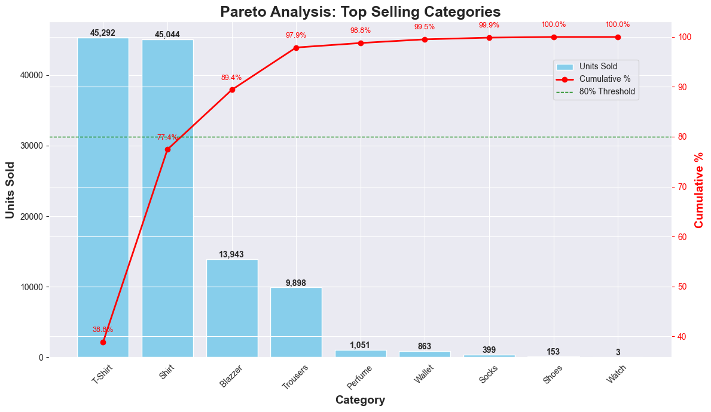
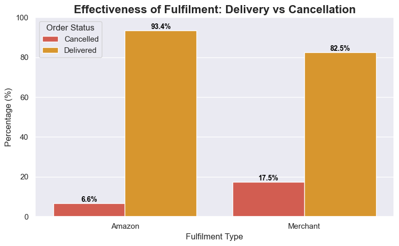
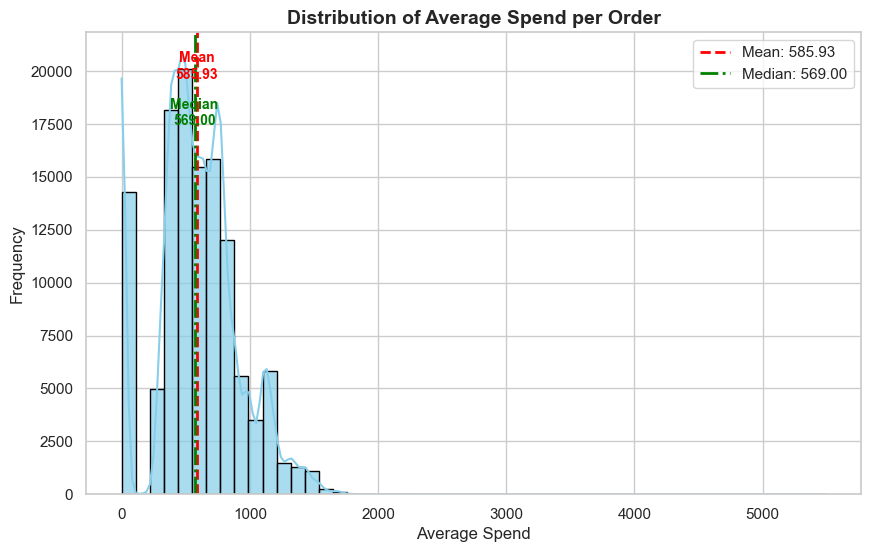
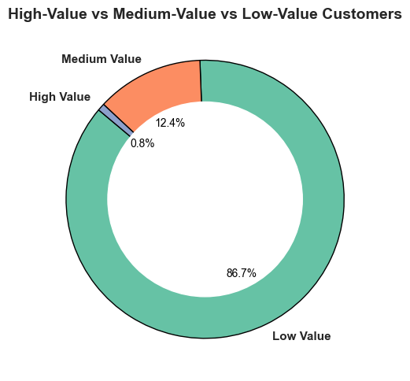
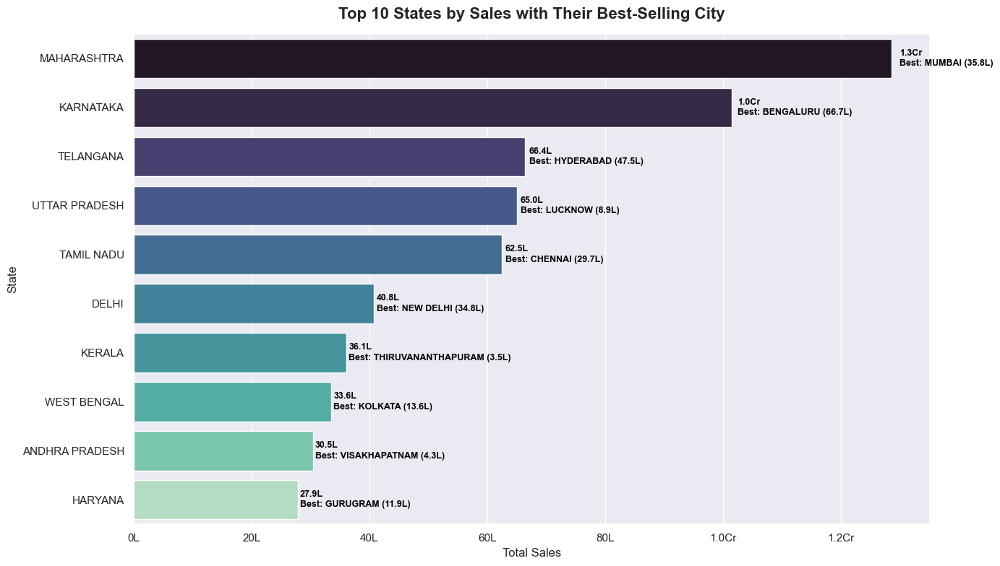

# 📊 Amazon Sales Report Analysis

## 📌 Overview
This project involves an **Exploratory Data Analysis (EDA)** of Amazon sales transactions. The dataset contains details such as order ID, date, order status, fulfillment method, sales channel, product category, size, quantity, amount, and shipping information.  
The primary goal is to extract **actionable insights** that can help optimize sales strategies, improve operational efficiency, and enhance customer satisfaction.

---

## 📂 Dataset
The dataset consists of sales records with the following key features:

* **Order Information:** Order ID, Date, Status, Sales Channel, Fulfillment Method  
* **Product Details:** Product Category, Size, Quantity, Amount  
* **Customer/Shipping Details:** City, State, Pin Code, Ship Service Level  

---

## 🎯 Key Objectives
1. **Sales Overview** – Understand overall sales performance, trends, and patterns over time.  
2. **Product Analysis** – Analyze product categories, sizes, and quantities to identify popular items.  
3. **Fulfillment Analysis** – Examine fulfillment methods and their effectiveness.  
4. **Customer Segmentation** – Segment customers based on purchase behavior and location.  
5. **Geographical Analysis** – Explore sales distribution across states and cities.  
6. **Business Insights** – Provide actionable recommendations for improving sales and customer satisfaction.  

---

## 📊 Visualizations & Insights  

| **Monthly Sales Trend** | **Revenue Distribution** |
| :---: | :---: |
|  |  |
| Peak in April – Revenue hit ₹16.7M, the highest in the dataset.Declining Trend – Revenue fell 15% in May (₹14.5M) and another 17% in June (₹12.2M).Q2 Drives 100% Sales – Entire revenue (₹43.4M) comes from just 3 months, showing extreme sales concentration. | Most sales volume comes from **₹200–₹1,000 orders**, revenue is driven by **mid-to-high value and outlier purchases**, forming **three customer bands: budget (<₹200), core (₹200–₹1,000), and premium (>₹1,500)**.|

| **Category Distribution** | **Size Distribution** |
| :---: | :---: |
|  |  |
| Sales are **heavily concentrated**, with T-Shirts and Shirts driving **83% of total sales**, followed by a sharp drop in Blazers and Trousers. This creates clear tiers: **top-performers to prioritize**, **mid-tier needing growth**, and **underperformers (e.g., Watch, 3 units)** that may warrant discontinuation.| Mid-range sizes (M, L, XL, XXL, and S) dominate demand with over 78% of total orders, while extreme sizes like XS and 4XL–6XL contribute less than 1% each, highlighting a strong size concentration; hence, inventory should focus heavily on popular mid-range sizes, with minimal stocking or phasing out of low-demand extremes to optimize costs and prevent unsold stock. |

| **Category + Size Combination Analysis** | **Top Selling Products** |
| :---: | :---: |
|  |  |
| Sales show **size-specific leadership**, with T-shirts dominating smaller sizes (XS, S, M) and shirts leading larger sizes (L, XL, XXL), while T-shirts and shirts consistently outperform Blazers and Trousers across most sizes. Extreme sizes (4XL–6XL) see minimal demand across all categories, with only shirts and T-shirts receiving occasional orders, indicating that the market for these sizes is a small niche served mainly by the top-performing products.| The sales distribution follows the **80/20 rule**, with T-Shirts and Shirts alone accounting for **77.4%** of units sold, and the top three categories (T-Shirt, Shirt, Blazer) driving **89.4%** of total sales, while the remaining six categories contribute less than 11%, highlighting that the bulk of revenue comes from a small subset of products and the long tail has minimal impact.|

| **Effectiveness (Delivery vs Cancellation)** | **Buying Behaviour Segmentation** |
| :---: | :---: |
|  |  |
| Amazon-fulfilled orders are highly reliable, with **93.4% delivered successfully** and only **6.6% cancelled**, whereas Merchant-fulfilled orders face a **17.5% cancellation rate**—nearly three times higher—indicating stock, shipping, or efficiency issues; overall, Amazon ensures a much better customer experience, while Merchants must reduce cancellations to remain competitive.| Customer purchase analysis reveals that **94% of buyers are one-time customers**, highlighting a severe retention gap and low brand loyalty, while average spend is modest (\~₹586) with most orders between ₹500–₹1,000, though a small premium segment exists. Revenue is heavily driven by **T-shirts (₹3.8 Cr) and Shirts (₹2 Cr)**, with accessories contributing minimally but offering cross-sell opportunities. Overall, the business should focus on **retention through loyalty programs and personalized campaigns**, **increase average order value via upselling and bundles**, and **leverage accessories to supplement apparel-driven revenue**.|

| **High-Value vs Low-Value Customers** | **Best Selling Cities from Top States** |
| :---: | :---: |
|  |  |
| The customer base is **dominated by low-value buyers (86.7% spending <₹1000)**, with a small medium-value segment (12.4% spending ₹1000–₹2000) and very few high-value customers (0.8% spending >₹2000), indicating heavy reliance on volume. To grow sustainably, the business should use **loyalty programs and targeted offers** to move low-value buyers up, **retain high-value customers** with personalized benefits, and promote the purchasing patterns of medium/high-value groups to the larger low-value segment.| Maharashtra leads sales with ₹1.3 Cr, driven largely by Mumbai (27% of state sales), followed by Karnataka at ₹1.0 Cr with Bengaluru contributing \~67%, making it the top single-city performer. Telangana and Tamil Nadu are heavily city-centric (Hyderabad, Chennai), while Delhi’s sales are almost entirely from New Delhi. In contrast, states like Uttar Pradesh, West Bengal, Kerala, and Haryana have more evenly distributed demand across multiple cities. Overall, **Mumbai and Bengaluru are the most critical markets**, while other states offer opportunities through broader city-level engagement.|

---

## ✅ Conclusion

### 🔑 Key Insights
* **Revenue Concentration:** The business generated **₹75.4M from 128,976 orders**, but most sales are concentrated in **T-shirts and Shirts**.  
* **Low Average Order Value (AOV):** AOV is just **₹585**, with most orders containing one item → strong upselling/cross-selling potential.  
* **Customer Retention Gap:** Over **86% of customers spend <₹1,000**, and only ~6% are repeat buyers → poor retention.  
* **Geographic & Seasonal Dependence:** Sales concentrated in **Maharashtra & Karnataka** (esp. **Bengaluru & Mumbai**). Demand peaks in **Q2 (Apr–Jun)** and on **Saturdays**.  
* **Operational Issues:** **10% cancellations**, mainly in **Merchant-fulfilled orders**, highlighting inefficiencies.  

### 📌 Strategic Recommendations
1. **Increase AOV** – Bundle offers, cross-sell accessories, and set a **free shipping threshold**.  
2. **Boost Retention** – Launch a **loyalty program** and personalized re-engagement campaigns.  
3. **Optimize Marketing & Operations** – Focus on **top categories & regions**, leverage **Q2 & Saturdays**, and reduce cancellations by strengthening **Amazon Fulfilled logistics**.  

---

✨ By targeting these three levers — **higher order value, better retention, and streamlined operations** — the business can shift from high-volume, low-value transactions to a **profitable and sustainable growth model**.  

---

## 📌 Tech Stack
* **Language:** Python  
* **Libraries:** Pandas, Matplotlib, Seaborn  
* **Tools:** Jupyter Notebook  

---

## 🚀 Future Scope
* Advanced customer segmentation using clustering (K-Means/DBSCAN).  
* Predictive modeling of future sales using Machine Learning.  
* Interactive dashboards with Tableau/Power BI for business teams.  

---

✨ *This project was done as part of my Internship on Data Analytics. The analysis provides both high-level patterns and actionable insights to support better decision-making for e-commerce growth.*  
